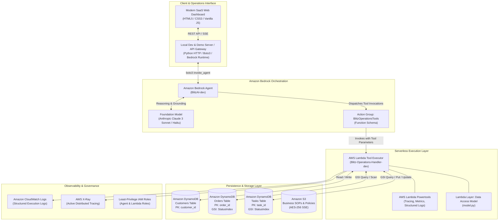

# Blitz AI — AI Operations Agent for Small Businesses

> **Intelligent, serverless operations assistant designed to help small businesses, e-commerce merchants, and retail operators automate order tracking, resolve delayed shipments, coordinate customer follow-ups, and get real-time business health overviews.**

[](https://aws.amazon.com/bedrock/)
[](https://aws.amazon.com/lambda/)
[](https://aws.amazon.com/dynamodb/)
[](https://aws.amazon.com/serverless/sam/)
[-10B981)](tests/unit/test_operations.py)

---

## 1. Product Overview

Small business owners and operations teams spend hours every day toggling between order portals, tracking delayed deliveries, and manually texting or emailing customers.

**Blitz AI** solves this with an enterprise-grade AI Operations Copilot that:
1. **Understands Natural Language Intent:** Answers queries like *"Show me delayed orders"*, *"What's happening with ORD-1003?"*, or *"Give me a summary of today's business issues."*
2. **Executes Actionable Tools:** Directly retrieves, queries, updates, and creates data in DynamoDB tables using 7 specialized Amazon Bedrock Agent tools.
3. **Zero Hallucination:** Adheres strictly to grounded enterprise data. Never guesses order statuses, prices, or customer identities.
4. **Automates Customer Retention:** Detects delayed orders, identifies the customer, and automatically generates prioritized follow-up tasks.
5. **Modern Real-Time Dashboard:** Features a clean SaaS interface with live tabs for AI Assistant, Orders, Customers, Tasks, and Business Overview.

---

## 2. Architecture Diagram



---

## 3. Core Features & Data Models

### A. Customers
Stores verified buyer accounts and contact channels:
- `customer_id` (Primary Key, e.g. `CUST-001`)
- `name` (e.g. `Priya Sharma`)
- `email` (e.g. `priya.sharma@example.com`)
- `phone` (e.g. `+91 98765 43210`)
- `created_at` (ISO date)

### B. Orders
Tracks commerce fulfillments and delivery exceptions:
- `order_id` (Primary Key, e.g. `ORD-1003`)
- `customer_id` (Foreign Key, e.g. `CUST-001`)
- `product` (e.g. `Wireless Keyboard`)
- `amount` (e.g. `₹2,499`)
- `status` (`pending`, `processing`, `shipped`, `delivered`, `delayed`, `cancelled`)
- `order_date` (e.g. `2026-09-20`)
- `expected_delivery` (e.g. `2026-09-24`)
- **Global Secondary Index:** `StatusIndex` (`status` HASH, `order_date` RANGE)

### C. Follow-up Tasks
Manages operational action items and customer outreach:
- `task_id` (Primary Key, e.g. `TASK-001`)
- `customer_id` (e.g. `CUST-001`)
- `order_id` (e.g. `ORD-1003`)
- `description` (e.g. `Follow up with Priya about delayed order ORD-1003`)
- `priority` (`high`, `medium`, `low`)
- `status` (`pending`, `completed`, `in_progress`)
- `created_at` (Timestamp)
- `due_date` (Date)
- **Global Secondary Index:** `StatusIndex` (`status` HASH, `priority` RANGE)

---

## 4. Bedrock Agent Action Group Tools

Blitz AI equips the Bedrock Agent with 7 dedicated functions in the `BlitzOperationsTools` action group:

| Tool Name | Parameters | Description |
|---|---|---|
| `get_order` | `order_id` (required) | Looks up order details in DynamoDB and enriches with customer contact info. |
| `get_customer` | `customer_id` (required) | Retrieves customer profile and their order history. |
| `search_orders` | `status` (required) | Queries orders matching a specific status (`delayed`, `pending`, etc.) using GSI. |
| `create_followup_task` | `customer_id`, `order_id`, `description`, `priority` | Automatically generates and saves a follow-up task. |
| `list_pending_tasks` | *None* | Lists all unresolved tasks sorted with `high` priority first. |
| `complete_task` | `task_id` (required) | Marks a task as `completed` with completion timestamp. |
| `get_business_summary` | *None* | Aggregates store health: total orders, delay count, pending tasks, pipeline revenue. |

---

## 5. Web UI & Dashboard

The web dashboard is built using modern vanilla HTML5, CSS3, and JavaScript, designed with an Obsidian Dark glassmorphic aesthetic:

1. **🤖 AI Assistant (Main Screen):**
   - Interactive chat stream with typing indicators and model attribution.
   - Clickable prompt chips for instant demo execution.
   - Execution badges displaying tool name and parameters (`⚡ Bedrock Tool: search_orders(...)`).
   - Grounded payload cards for orders and tasks.
2. **📦 Orders:**
   - Filter pills with real-time counters: *All, Delayed, Pending, Processing, Shipped, Delivered, Cancelled*.
   - Live search by Order ID, Product, or Customer.
   - "Ask Agent" quick-action buttons on every row.
3. **👥 Customers:**
   - Visual cards showing buyer profile, email, phone, and badge list of linked orders.
4. **📋 Tasks:**
   - Filterable by *All, Pending Only, High Priority, Completed*.
   - One-click "Complete" buttons that update DynamoDB live.
   - "Create Task" modal.
5. **📊 Business Overview:**
   - 5 KPI metric cards: *Total Orders, Pending Orders, Delayed Orders (alert pulse), Completed Tasks, Customers*.
   - Immediate Attention panel for delayed orders.
   - Operations timeline logging real-time store events.

---

## 6. Official Hackathon Demo Script

Follow this step-by-step sequence to demonstrate Blitz AI to judges:

| Step | Action | Expected Agent Response |
|---|---|---|
| **1** | Open dashboard at `http://localhost:3000` | Dashboard loads with Obsidian Dark theme, active status badges, and suggested prompts. |
| **2** | Review Business Overview tab | Metrics show: **Total Orders: 7**, **Delayed Orders: 2**, **Pending Orders: 1**, **Completed Tasks: 1**, **Customers: 5**. |
| **3** | Click or ask: *"Show me all delayed orders."* | Agent executes `search_orders(status="delayed")` and displays `ORD-1003` (Priya Sharma) and `ORD-1004` (Vikram Malhotra). |
| **4** | Ask: *"What's happening with ORD-1003?"* | Agent executes `get_order(order_id="ORD-1003")` and reports that the Wireless Keyboard for Priya Sharma is delayed past its expected delivery date of 2026-09-24. |
| **5** | Ask: *"Create a high priority follow-up for the customer of ORD-1003."* | Agent executes `create_followup_task(...)` and confirms creation of `TASK-004` with `HIGH` priority for Priya Sharma. |
| **6** | Click **Tasks** tab | `TASK-004` immediately appears at the top of the pending tasks list with a red `HIGH` priority badge. |
| **7** | Ask: *"Give me a summary of today's business issues."* | Agent executes `get_business_summary()` and delivers an executive brief of delayed shipments, high-priority tasks, and actionable recommendations. |
| **8** | Ask: *"Mark task TASK-004 as completed."* | Agent executes `complete_task(task_id="TASK-004")` and updates task status to completed in DynamoDB. |

---

## 7. Quickstart & Local Testing

### Prerequisites
- Python 3.10+ (Python 3.12 / 3.14 compatible)
- Boto3, Pytest

### A. Run Unit Tests (100% Passed)
Run the automated test suite testing all 7 Lambda tool actions and DynamoDB mock integrations:
```bash
python -m pytest tests/unit/test_operations.py -v
```

### B. Launch Local Web Dashboard & Dev Server
Run the local development server:
```bash
python server.py --port 3000
```
Open **[http://localhost:3000](http://localhost:3000)** in your browser.

### C. Seed Demo Data via CLI
To seed DynamoDB tables locally or in your AWS account:
```bash
python seed_data.py --env dev
```

---

## 8. AWS SAM Deployment Instructions

### Prerequisites
1. **AWS CLI** configured (`aws configure`).
2. **AWS SAM CLI** installed (`sam --version`).
3. **Bedrock Model Access**: Ensure **Anthropic Claude 3 Sonnet** or **Claude 3 Haiku** is enabled in your AWS region (e.g. `us-east-1` or `us-west-2`) under the Amazon Bedrock Console > Model Access.

### Step 1: Build the Application
```bash
sam build
```

### Step 2: Deploy to AWS
Deploy using guided mode to set parameter values and IAM capabilities:
```bash
sam deploy --guided --capabilities CAPABILITY_AUTO_EXPAND CAPABILITY_IAM CAPABILITY_NAMED_IAM
```

**Recommended Parameter Values during Guided Deploy:**
- **Stack Name**: `bizpilot-ai-stack`
- **AWS Region**: `us-east-1` (or `us-west-2`)
- **Parameter Environment**: `dev`
- **Parameter FoundationModel**: `anthropic.claude-3-sonnet-20240229-v1:0`

### Step 3: Automated Seeding
The stack includes a CloudFormation Custom Resource (`sample_data/template.yaml`) that automatically:
1. Populates `Blitz-Customers-dev`, `Blitz-Orders-dev`, and `Blitz-Tasks-dev` with realistic demo data.
2. Uploads business SOP documents to the S3 bucket.
3. Automatically calls `bedrock-agent.prepare_agent` to ready the agent for immediate testing.

---

## 9. Security, Least Privilege & Cost Analysis

### Security & IAM Least Privilege
- **No Wildcard DynamoDB Policies:** The Lambda execution role has access strictly restricted to `CustomersTableArn`, `OrdersTableArn`, `TasksTableArn`, and their specific GSI indexes (`/index/*`).
- **Bedrock Agent Role:** Restricted to invoking only the `BlitzOperationsFunction` and specified foundation models.
- **S3 Encryption:** The business documents bucket enforces AES-256 server-side encryption with public access block configurations enabled.

### Cost Efficiency
- **DynamoDB Pay-Per-Request:** `BillingMode: PAY_PER_REQUEST` ensures $0 idle cost when no queries are being executed.
- **Serverless Lambda:** Only charged per millisecond of tool execution.
- **No OpenSearch Serverless Cluster Required:** Unlike legacy templates that run idle OpenSearch vector clusters ($700+/mo), Blitz AI uses DynamoDB and lightweight S3 storage, keeping AWS monthly bills under $5 for typical small business workloads.

---

## 10. Repository File Structure

```
.
├── agent/
│   ├── functions/
│   │   └── operations/
│   │       ├── app.py             # Bedrock Agent 7-tool Lambda handler
│   │       ├── requirements.txt   # Lambda dependencies
│   │       └── __init__.py
│   └── template.yaml              # Bedrock Agent, Action Group & IAM template
├── assets/
│   └── sops/
│       ├── SOP_Delayed_Orders.md          # Business SOP for delay resolution
│       └── Customer_Communication_Policy.md # Communication guidelines
├── datastores/
│   └── template.yaml              # DynamoDB tables (Customers, Orders, Tasks) & S3
├── layers/
│   ├── layers.yaml                # Lambda Layer specifications
│   ├── model/
│   │   ├── model.py               # Unified DynamoDB access layer
│   │   └── Makefile
│   └── powertools/                # AWS Lambda Powertools layer
├── sample_data/
│   ├── functions/
│   │   └── sample_data_deployment/
│   │       ├── app.py             # Custom resource data seeder
│   │       └── assets/            # Packaged business SOP documents
│   └── template.yaml              # CloudFormation custom resource stack
├── tests/
│   └── unit/
│       └── test_operations.py     # 9 Comprehensive unit tests (100% pass)
├── web/
│   ├── index.html                 # Modern SaaS Web Dashboard
│   ├── styles.css                 # Obsidian Dark Glassmorphic Design System
│   └── app.js                     # Reactive Frontend state & chat engine
├── Makefile                       # SAM build and deploy shortcuts
├── README.md                      # Complete product documentation
├── seed_data.py                   # Standalone CLI data seeder
├── server.py                      # Local dev server & Bedrock runtime proxy
└── template.yaml                  # Root AWS SAM orchestration template
```

---

## License

This project is licensed under the MIT-0 License. See the [LICENSE](LICENSE) file for details.
